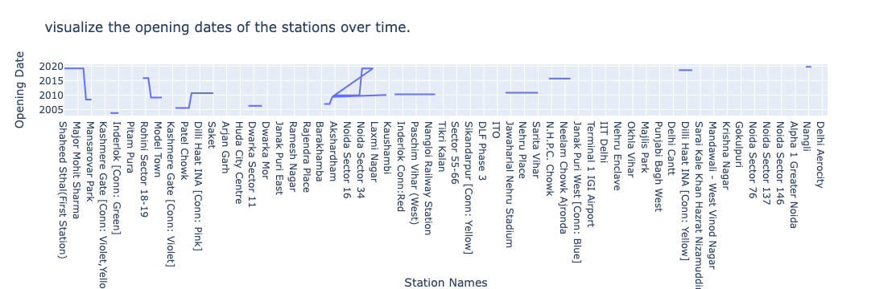
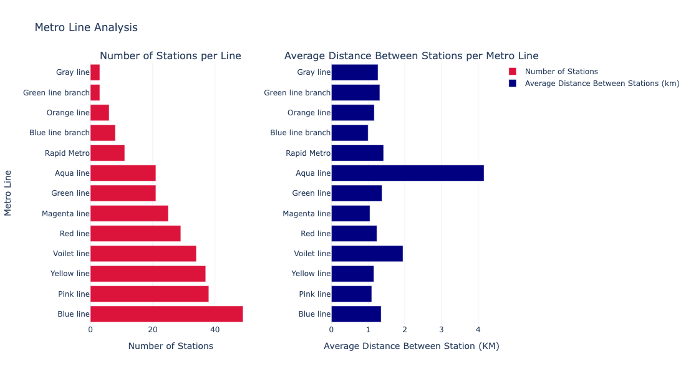
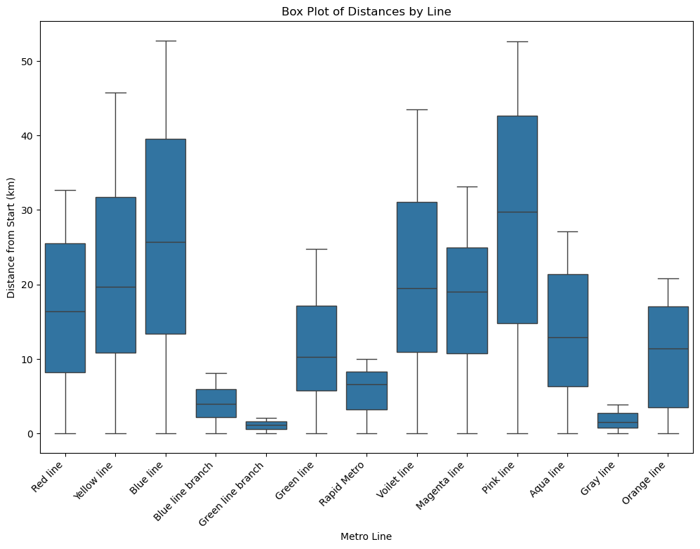
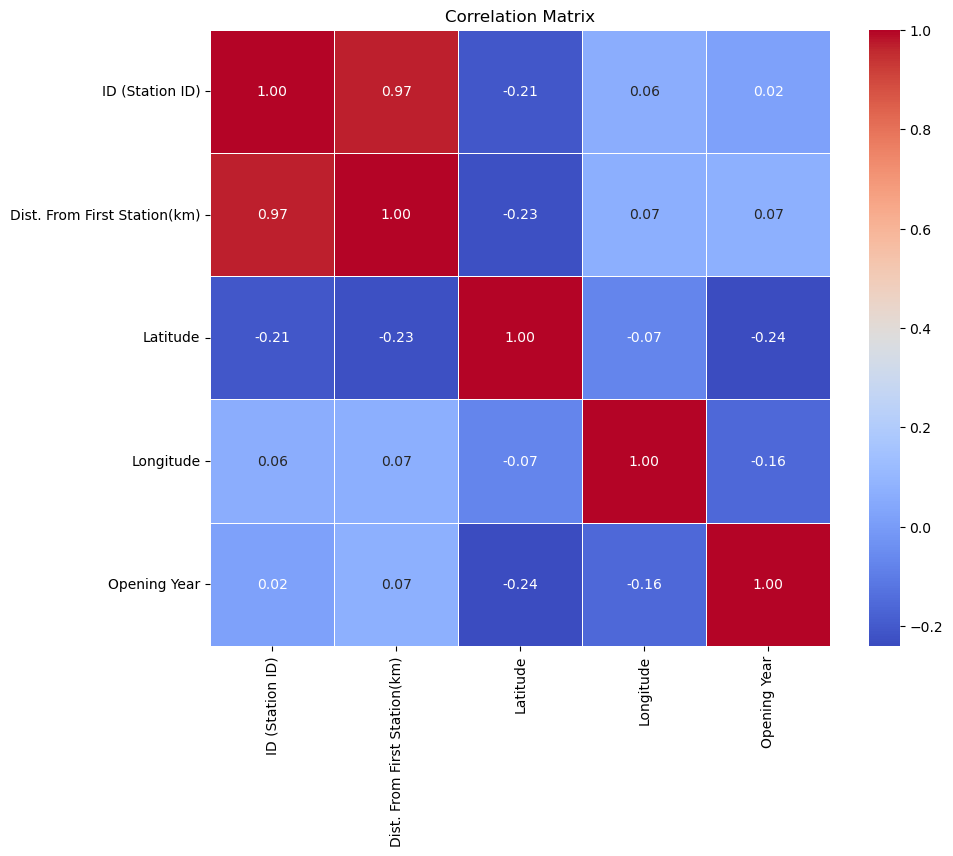
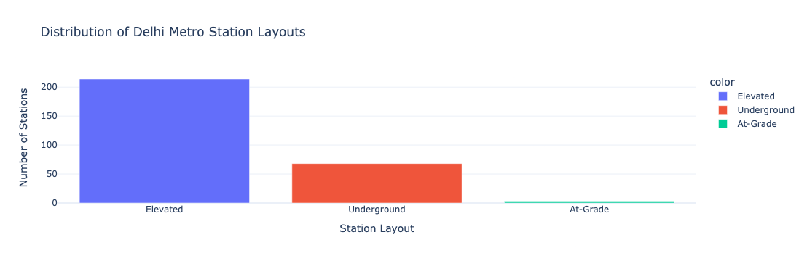

# 🚇 Delhi Metro Network Analysis


An exploratory analysis of the **Delhi Metro network** — one of India's largest urban transit systems — looking at how the network has grown over time, how its 13 lines compare, and what the station-layout mix looks like across the city.

---

## 📋 Table of Contents

- [Motivation](#-motivation)
- [Dataset](#-dataset)
- [Key Findings](#-key-findings)
  - [Network Growth Over Time](#network-growth-over-time)
  - [Line-Level Comparison](#line-level-comparison)
  - [Distance Distribution by Line](#distance-distribution-by-line)
  - [Correlation Overview](#correlation-overview)
  - [Station Layout Mix](#station-layout-mix)
- [Tools Used](#-tools-used)
- [Project Structure](#-project-structure)
- [Getting Started](#-getting-started)

---

## 🎯 Motivation

Analysing the metro network in a city like Delhi helps improve urban transportation infrastructure, leading to better city planning and an enhanced commuter experience. This project explores the network's growth, structure, and geography to surface patterns useful for that kind of planning.

---

## 📦 Dataset

The dataset contains **285 metro stations** across **8 columns**, with no missing values:

| Field | Description |
|---|---|
| `ID (Station ID)` | Unique station identifier |
| `Station Names` | Name of the station |
| `Dist. From First Station(km)` | Distance from the start of its line |
| `Line` | Which of the 13 metro lines the station belongs to |
| `Opening Date` | Date the station opened |
| `Layout` | Elevated, Underground, or At-Grade |
| `Latitude` / `Longitude` | Geographic coordinates |

The network spans **13 lines**: Red, Yellow, Blue (+ branch), Green (+ branch), Rapid Metro, Violet, Magenta, Pink, Aqua, Gray, and Orange.

> 🗺️ The notebook also builds an interactive Folium map (colored markers per line, with station tooltips). That map is best explored live in the notebook — it's an HTML widget rather than a static image, so it isn't reproduced here.

---

## 📊 Key Findings

### Network Growth Over Time

Station openings were highly uneven — most of the network arrived in a handful of expansion waves rather than steadily. **2010 was by far the biggest year, with 42 new stations opening** in a single year, dwarfing every other year on record.

<p align="center">
  
</p>

The full station-by-station opening timeline shows the same pattern — long quiet stretches punctuated by big expansion jumps:

<p align="center">
  
</p>

### Line-Level Comparison

The **Blue line** is the backbone of the network — both the **longest line** (52.7 km) and the one with the **most stations (49)**. It's followed by the Pink line (38 stations, 52.6 km) and Yellow line (37 stations, 45.7 km).

At the other end, small connector lines like **Gray line** (3 stations) and **Green line branch** (3 stations) serve a much more limited footprint.

<p align="center">
  
</p>

Interestingly, station *count* doesn't track station *spacing*: the **Orange line** has by far the widest average gap between stations (**4.16 km**, the Airport Express line), while most other lines space stations roughly **1–2 km** apart.

### Distance Distribution by Line

Looking at the spread of "distance from first station" per line highlights how far each line's stations range from their starting point — Blue and Pink lines cover the widest span, while smaller lines like Gray and Green line branch stay tightly clustered near their origin.

<p align="center">
  
</p>

### Correlation Overview

A correlation matrix across the numeric fields shows one very strong relationship: **Station ID and distance from the first station correlate at 0.97** — expected, since station IDs were assigned sequentially along each line as it was built outward. Latitude, longitude, and opening year show only weak correlations with the other fields, suggesting geography and construction timing were largely independent of how stations were numbered.

<p align="center">
  
</p>

### Station Layout Mix

The network is overwhelmingly **elevated**: roughly **213 stations are elevated**, compared to about **68 underground** and only a handful **at-grade** — reflecting a construction strategy favoring elevated viaducts over tunneling for most of the network's expansion.

<p align="center">
  
</p>

---

## 🛠 Tools Used

- **Python**
- **Pandas** — data wrangling
- **Plotly Express / Graph Objects** — interactive charts
- **Matplotlib** & **Seaborn** — static charts (box plot, correlation heatmap)
- **Folium** — interactive geographic mapping
- **NetworkX** — network-oriented analysis
- **Jupyter Notebook** — analysis environment

---

## 📁 Project Structure

```text
delhi-metro-analysis/
│
├── data/
│   └── Delhi_Metro_Network_Analysis.csv
│
├── notebooks/
│   └── Delhi_Metro_Network_Analysis_using_Python.ipynb
│
├── assets/
│   └── (charts used in this README)
│
└── README.md
```

---

## 🚀 Getting Started

```bash
# Clone the repository
git clone <your-repo-url>
cd delhi-metro-analysis

# Install dependencies
pip install pandas plotly matplotlib seaborn folium networkx jupyter

# Launch the notebook
jupyter notebook notebooks/Delhi_Metro_Network_Analysis_using_Python.ipynb
```

---

<p align="center"><i>All figures above are generated directly from the analysis notebook.</i></p>
